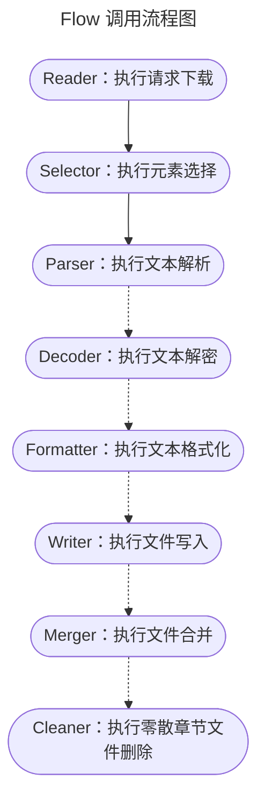
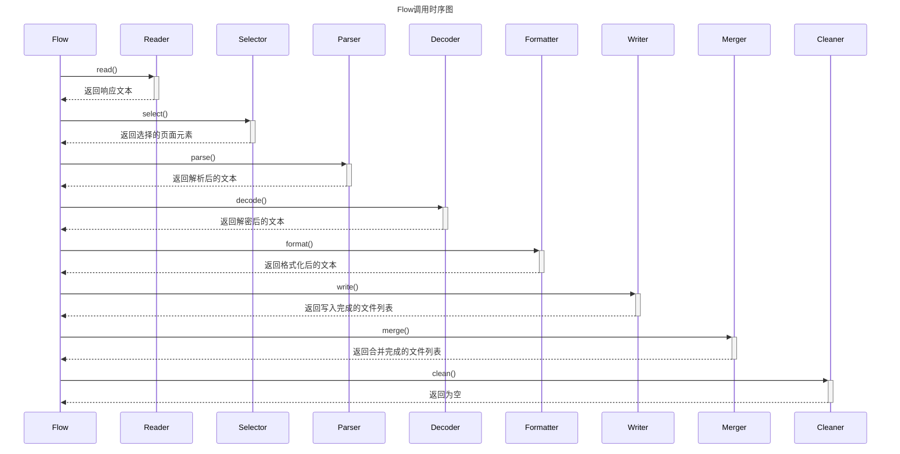
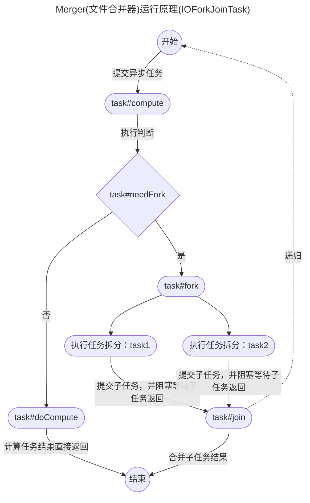

## A simple Java web spider for downloading e-books from ShuQi Novels

https://blog.csdn.net/qq_40553917/article/details/140622178

### 内容概览

- 功能：Java爬虫
- 来源：书旗小说网免费章节
- 环境：JDK25
- 涉及：
	1. 流程设计
	2. 设计模式
	3. 任务编排
	4. 并发控制
	5. 多线程文件合并
	6. 分治思想
	7. 池化思想

---

### 流程概览

